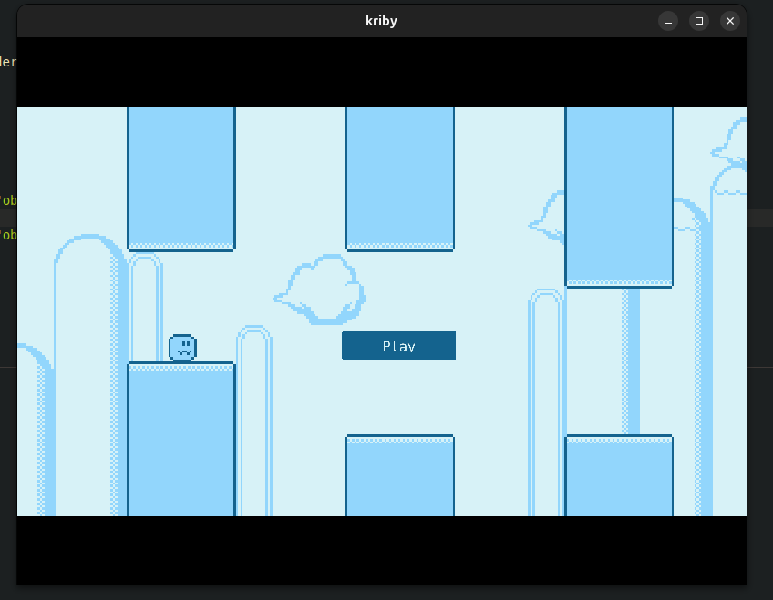

# Kirby Game

A fun and interactive game named **Kirby**, developed using Tauri and powered by modern web technologies.

## Prerequisites

Ensure you have the required setup by following the [Tauri prerequisites guide](https://v2.tauri.app/start/prerequisites/).

## Preview



## How to Run

1. Clone the repository and navigate to the project directory.
2. Install dependencies:
   ```bash
   npm install
   ```
3. Start the development server:
   ```bash
   npm run dev
   ```

Enjoy playing Kirby! 🎮
